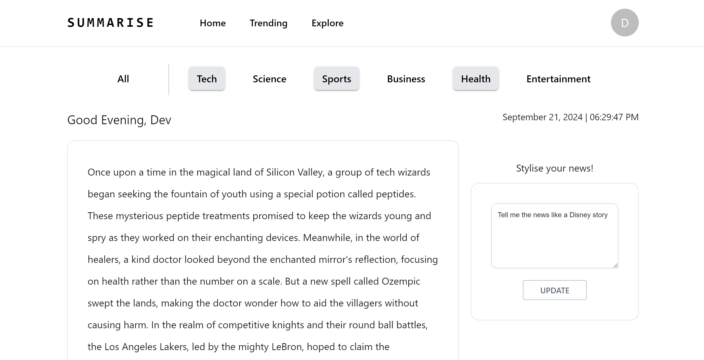
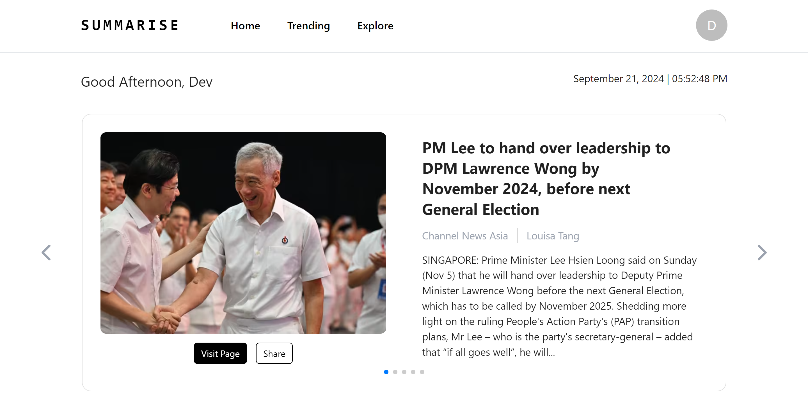
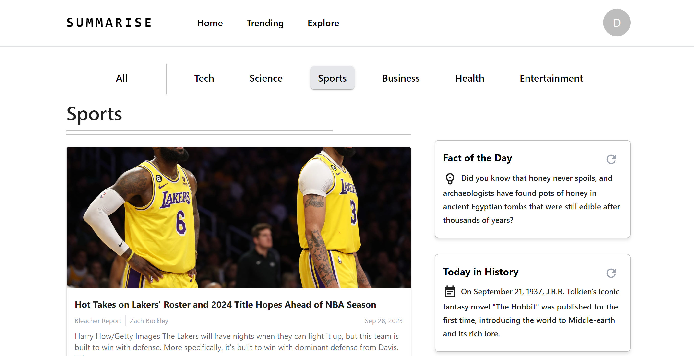

# Summarise

> Delivering to you what matters.

[_Summarise_](https://summarise.vercel.app/) delivers concise and informative news summaries that cater to the unique lifestyles and preferences of our audience, by harnessing the power of LLMs to offer personalized experiences.

Staying informed should be accessible, efficient, and inclusive, hence _Summarise_ provides a tech-driven news consumption experience that enriches lives and fosters informed decision-making. In harmony with the Smart Nation principles, it provides equitable access to information and knowledge, leaving no citizen behind in the digital age. It also aims to foster a culture of inclusivity, where the benefits of technology are harnessed to empower every individual in our diverse society.

## Features

### :house: Home

Upon landing on the `Home` page, Summarise dynamically generates a summary of daily news within categories that users opt in to. Furthermore, it provides a way to personalize one's news feed via a `stylise prompt` to deliver news the way you want it.

### :date: Trending

Under the `Trending` page, users can easily view most relevant trending news articles scraped from multiple news platforms.

### :mag: Explore

On the `Explore` page, users can dive into a wealth of scraped articles by utilizing the category filters at the top. For an extra touch of engagement, the page also features a `Fact of the Day` and a `Today in History` section, offering a fascinating random fact and a notable event from this day in the past.
